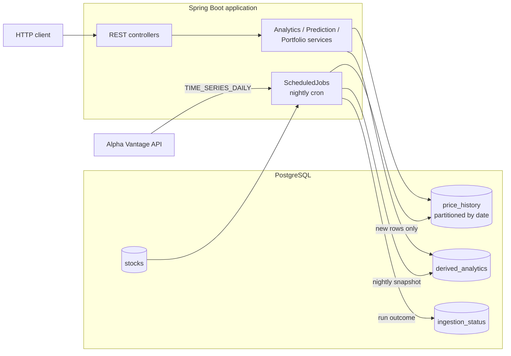

# FinData Analytics API

A Spring Boot REST API that ingests daily market data, stores it in a date-partitioned PostgreSQL schema, and serves computed financial analytics over HTTP.


> **Project status:** archived.
> The AWS deployment described under [Deployment](#deployment) has been decommissioned, so there is no public endpoint.
> [Getting Started](#getting-started) runs the full stack locally.

## Contents

- [Overview](#overview)
- [Architecture](#architecture)
- [Tech Stack](#tech-stack)
- [Getting Started](#getting-started)
- [API Reference](#api-reference)
- [Analytics Methodology](#analytics-methodology)
- [Data Ingestion](#data-ingestion)
- [Database Schema](#database-schema)
- [Error Handling](#error-handling)
- [Project Structure](#project-structure)
- [Deployment](#deployment)
- [License](#license)

## Overview

FinData aggregates daily OHLCV (open, high, low, close, volume) price data for a set of tracked tickers and exposes it through a REST API alongside derived metrics.

It does three things:

1. **Ingests** daily prices from the Alpha Vantage API on a nightly schedule, pacing requests to stay inside the provider's rate limit and recording the outcome of every run.
2. **Stores** prices in a PostgreSQL table partitioned by date, with pre-computed analytics kept in a separate table so that read traffic does not pay the cost of recalculation.
3. **Serves** per-stock analytics, a regression-based trend estimate, and portfolio-level what-if metrics over a paginated, validated REST interface.

The API is read-oriented: most endpoints are `GET`, and the write endpoints exist to seed and operate the dataset rather than to serve end users.

## Architecture



The application is a single Spring Boot process; the scheduler runs in the same JVM as the web layer.

There are two paths through the system:

- **Write path (scheduled).** A cron job reads the tracked tickers, fetches each one from Alpha Vantage, filters out dates already stored, persists the remainder, computes that ticker's analytics, and writes them to `derived_analytics`. Each run opens and closes a row in `ingestion_status`.
- **Read path (per request).** Analytics, trend estimates, and portfolio metrics are computed from `price_history` at request time. The one exception is `/analytics/cached`, which reads the nightly snapshot from `derived_analytics`.

Layering follows the conventional Spring structure: controllers depend on services, services depend on Spring Data repositories, and repositories map to JPA entities.
Flyway owns the schema and Hibernate runs in `validate` mode, so the database is never mutated by the ORM.

## Tech Stack

| Area | Choice | Notes |
| --- | --- | --- |
| Language | Java 17 | |
| Framework | Spring Boot 3.5.9 | Web, Data JPA, Validation, Actuator, AOP |
| Database | PostgreSQL 15 | Range partitioning on `price_history` |
| Migrations | Flyway | 6 versioned migrations, `validate-on-migrate` enabled |
| Persistence | Spring Data JPA / Hibernate | `ddl-auto: validate` |
| Connection pool | HikariCP | Max pool 10, min idle 5 |
| Math | Apache Commons Math 3.6.1 | `OLSMultipleLinearRegression` |
| Data source | Alpha Vantage `TIME_SERIES_DAILY` | Free tier |
| Build | Maven | |
| Container | Docker | Multi-stage build |
| Boilerplate | Lombok | |

## Getting Started

### Prerequisites

- Java 17
- Maven 3.9+
- PostgreSQL 15, or Docker to run it

### 1. Start PostgreSQL

```bash
docker run -d --name findata-db \
  -e POSTGRES_USER=postgres \
  -e POSTGRES_PASSWORD=postgres \
  -e POSTGRES_DB=financial_data \
  -p 5432:5432 \
  postgres:15
```

### 2. Configure

All settings read from environment variables with local defaults, so a default Postgres on `localhost:5432` needs no configuration at all.
To point elsewhere, or to use a real Alpha Vantage key:

| Variable | Default | Purpose |
| --- | --- | --- |
| `DATABASE_URL` | `jdbc:postgresql://localhost:5432/financial_data` | JDBC connection string |
| `DATABASE_USERNAME` | `postgres` | Database user |
| `DATABASE_PASSWORD` | `postgres` | Database password |
| `ALPHAVANTAGE_API_KEY` | `demo` | Alpha Vantage key; a [free key](https://www.alphavantage.co/support/#api-key) is required for real ingestion |

### 3. Run

```bash
mvn spring-boot:run
```

Flyway applies all six migrations on first start.
The API listens on `http://localhost:8080`.

```bash
curl http://localhost:8080/actuator/health
```

### 4. Load data

The repository includes a script that registers 25 large-cap tickers and optionally kicks off an ingestion run:

```bash
pip install requests
python3 scripts/add_stocks.py http://localhost:8080
```

Ingestion is paced at one request every 13 seconds to respect the Alpha Vantage free tier, so a full run over 25 tickers takes roughly five minutes.

### Running with Docker

The included multi-stage `Dockerfile` builds the project with Maven and runs the resulting jar on a JRE base image:

```bash
docker build -t findata-api .
docker run -p 8080:8080 \
  -e DATABASE_URL=jdbc:postgresql://host.docker.internal:5432/financial_data \
  -e DATABASE_USERNAME=postgres \
  -e DATABASE_PASSWORD=postgres \
  -e ALPHAVANTAGE_API_KEY=your_key \
  findata-api
```

### Tests

```bash
mvn test
```

## API Reference

Base URL: `http://localhost:8080`

No endpoint requires authentication.
Endpoints marked **W** write to the database or call the upstream provider.

### Stocks

| Method | Path | Description |
| --- | --- | --- |
| `GET` | `/api/stocks` | List all tracked stocks |
| `GET` | `/api/stocks/{ticker}` | Get a single stock |
| `POST` | `/api/stocks` | **W** Register a stock |
| `DELETE` | `/api/stocks/{ticker}` | **W** Remove a stock and, by cascade, all of its price history |

### Price History

| Method | Path | Description |
| --- | --- | --- |
| `GET` | `/api/prices/{ticker}` | Paginated price history, newest first |
| `GET` | `/api/prices/{ticker}/latest` | Most recent stored price |
| `GET` | `/api/prices/{ticker}/range` | Paginated, sortable price history over a date range |
| `POST` | `/api/prices` | **W** Insert a single price record |
| `POST` | `/api/prices/bulk` | **W** Insert a list of price records |

Query parameters for `/range`: `startDate` and `endDate` (required, `YYYY-MM-DD`), `page` (default `0`), `size` (default `50`), `sortBy` (default `date`), `sortDirection` (`asc` or `desc`, default `desc`).
`sortBy` maps directly onto entity fields: `date`, `open`, `high`, `low`, `close`, `volume`.

### Analytics

| Method | Path | Description |
| --- | --- | --- |
| `GET` | `/api/stocks/{ticker}/analytics` | Compute analytics from stored prices on request |
| `GET` | `/api/stocks/{ticker}/analytics/cached` | Return the most recent nightly snapshot |

The cached endpoint returns the latest row written by the scheduled job and does not fall back to live computation; it returns `404` if the job has not yet produced a row for that ticker.

### Trend Estimation

| Method | Path | Description |
| --- | --- | --- |
| `GET` | `/api/stocks/{ticker}/predict` | Five-day trend estimate from a linear regression baseline |

Requires at least 60 stored days for the ticker.

### Portfolio Analytics

| Method | Path | Description |
| --- | --- | --- |
| `POST` | `/api/portfolio/metrics` | What-if metrics for a user-supplied allocation |

This endpoint uses `POST` to accept a request body; it is a read-only computation and persists nothing.

### Ingestion Monitoring

| Method | Path | Description |
| --- | --- | --- |
| `GET` | `/api/ingestion/status/latest` | Most recent job run |
| `GET` | `/api/ingestion/status/history` | Last 10 job runs |
| `GET` | `/api/ingestion/status/failed` | All runs that ended in `FAILED` |
| `POST` | `/api/ingestion/trigger` | **W** Run the ingestion job immediately |

`POST /api/ingestion/trigger` executes the job on the request thread and returns only when the run finishes, so the request takes roughly 13 seconds per tracked ticker.

### Operational

| Method | Path | Description |
| --- | --- | --- |
| `GET` | `/api/test/fetch-and-save/{ticker}` | **W** Fetch and persist one ticker from Alpha Vantage |
| `GET` | `/actuator/health` | Health check |
| `GET` | `/actuator/info` | Build and application info |
| `GET` | `/actuator/metrics` | Micrometer metrics |

## Analytics Methodology

Every monetary value is handled as `BigDecimal` against `NUMERIC(12,4)` columns, with explicit scale and `HALF_UP` rounding at each division.
Windows are counted in **trading days** (stored rows), not calendar days.
Any metric whose window exceeds the available history returns `0`.

### Per-stock analytics

`GET /api/stocks/{ticker}/analytics`

| Field | Definition |
| --- | --- |
| `dailyChange`, `dailyChangePercent` | Change against the previous stored close |
| `weeklyChange`, `weeklyChangePercent` | Change against the close 7 trading days back |
| `monthlyChange`, `monthlyChangePercent` | Change against the close 30 trading days back |
| `movingAverage50Day`, `movingAverage200Day` | Arithmetic mean of the last 50 and 200 closes |
| `volatility30Day` | Standard deviation of the last 30 daily returns, annualized by √252 and expressed as a percentage |
| `sharpeRatio` | Annualized excess return over annualized volatility across 252 trading days, against a 2.5% annual risk-free rate |
| `week52High`, `week52Low` | Highest high and lowest low over the last 252 rows |
| `averageVolume30Day` | Mean volume over the last 30 rows |

```bash
curl http://localhost:8080/api/stocks/AAPL/analytics
```

```json
{
  "ticker": "AAPL",
  "asOfDate": "2025-01-22",
  "currentPrice": 184.30,
  "previousClose": 182.50,
  "dailyChange": 1.80,
  "dailyChangePercent": 0.99,
  "weeklyChange": 5.20,
  "weeklyChangePercent": 2.91,
  "monthlyChange": 12.40,
  "monthlyChangePercent": 7.21,
  "movingAverage50Day": 178.45,
  "movingAverage200Day": 165.32,
  "volatility30Day": 18.52,
  "sharpeRatio": 0.85,
  "week52High": 195.50,
  "week52Low": 142.30,
  "averageVolume30Day": 55000000
}
```

### Trend estimation

`GET /api/stocks/{ticker}/predict`

An ordinary least squares regression (`OLSMultipleLinearRegression`) over eight engineered features: the five most recent closes, a 10-day and a 20-day simple moving average, and the standard deviation of the last five daily returns.
The sample is split 80/20 into fit and hold-out sets, and RMSE, MAE, and R² are reported against the hold-out set.
The five-day horizon is generated recursively, each prediction feeding the feature window for the next.
Horizon dates advance one calendar day at a time from the most recent stored date, so they may fall on weekends.
Intervals are the point estimate ± 2 × RMSE.

This is a baseline for exploratory analysis, not a production forecast.

```bash
curl http://localhost:8080/api/stocks/AAPL/predict
```

```json
{
  "ticker": "AAPL",
  "modelType": "ols_linear_regression",
  "predictionDate": "2025-01-22",
  "predictions": [
    {
      "date": "2025-01-23",
      "predictedPrice": 185.50,
      "confidenceLower": 181.30,
      "confidenceUpper": 189.70
    }
  ],
  "metrics": {
    "rmse": 2.10,
    "mae": 1.65,
    "rSquared": 0.78,
    "trainSize": 48,
    "testSize": 12
  }
}
```

### Portfolio metrics

`POST /api/portfolio/metrics`

Weights must sum to 1.0 within a tolerance of ±0.01.
All figures are stated over the requested period rather than annualized, so that return and volatility remain directly comparable.

| Field | Definition |
| --- | --- |
| Position `returnPercent` | Percentage change between the first and last close in the range |
| Position `volatility` | Standard deviation of daily returns over the range, as a percentage |
| Position `contribution` | Position return × weight |
| `returnPercent` | Sum of position contributions |
| `volatility` | Weighted average of position volatilities |
| `sharpeRatio` | Portfolio return ÷ portfolio volatility |

This is what-if analysis for a given allocation, not portfolio optimization or a recommendation.

```bash
curl -X POST http://localhost:8080/api/portfolio/metrics \
  -H "Content-Type: application/json" \
  -d '{
    "positions": [
      {"ticker": "AAPL", "weight": 0.40},
      {"ticker": "GOOGL", "weight": 0.35},
      {"ticker": "MSFT", "weight": 0.25}
    ],
    "startDate": "2025-01-01",
    "endDate": "2025-12-31"
  }'
```

```json
{
  "startDate": "2025-01-01",
  "endDate": "2025-12-31",
  "returnPercent": -3.95,
  "volatility": 2.07,
  "sharpeRatio": -1.91,
  "positionMetrics": [
    {"ticker": "AAPL",  "weight": 0.40, "returnPercent": -4.50,  "volatility": 0.94, "contribution": -1.80},
    {"ticker": "GOOGL", "weight": 0.35, "returnPercent": -10.70, "volatility": 3.24, "contribution": -3.75},
    {"ticker": "MSFT",  "weight": 0.25, "returnPercent": 6.38,   "volatility": 2.23, "contribution": 1.60}
  ]
}
```

## Data Ingestion

A cron job runs daily at 18:00 `America/New_York`:

1. Opens an `ingestion_status` row with status `RUNNING`.
2. For each tracked ticker, fetches `TIME_SERIES_DAILY` from Alpha Vantage.
3. Loads the dates already stored for that ticker into a set and inserts only the dates missing from it, which keeps the job idempotent across re-runs.
4. Recomputes that ticker's analytics and writes a snapshot to `derived_analytics`.
5. Sleeps 13 seconds before the next ticker, pacing the job at roughly 4.6 requests per minute against the provider's 5-per-minute free tier.
6. Closes the `ingestion_status` row with per-ticker success and failure counts, or with an error message if the run aborts.

A failure on one ticker is caught and counted without aborting the run.
The same job is reachable on demand through `POST /api/ingestion/trigger`.

Query performance is observable through an AOP aspect that times every repository call and logs it at `WARN` above 100 ms, `INFO` above 50 ms, and `DEBUG` otherwise.

## Database Schema

Four tables, created and versioned by six Flyway migrations in `src/main/resources/db/migration`.

### `stocks`

```sql
ticker        VARCHAR(10) PRIMARY KEY
company_name  VARCHAR(255) NOT NULL
sector        VARCHAR(100)
market_cap    BIGINT
created_at    TIMESTAMP NOT NULL
updated_at    TIMESTAMP NOT NULL
```

Indexed on `sector` and on `market_cap DESC`.

### `price_history`

```sql
id          BIGSERIAL
ticker      VARCHAR(10) NOT NULL REFERENCES stocks(ticker) ON DELETE CASCADE
date        DATE NOT NULL
open        NUMERIC(12,4) NOT NULL
high        NUMERIC(12,4) NOT NULL
low         NUMERIC(12,4) NOT NULL
close       NUMERIC(12,4) NOT NULL
volume      BIGINT NOT NULL
created_at  TIMESTAMP NOT NULL
PRIMARY KEY (id, date)
UNIQUE (ticker, date)
PARTITION BY RANGE (date)
```

Partitioned by `date` so that range-scoped queries touch only the relevant partitions.
Partitions: one per month for calendar year 2025, plus a `DEFAULT` partition that receives every other date.

PostgreSQL requires the partition key to participate in the primary key, so the key is the composite `(id, date)` rather than `id` alone.
Migration `V3` performs the conversion in place: it renames the original table, creates the partitioned replacement, copies every row, advances the identity sequence with `setval`, and drops the original.

### `derived_analytics`

Stores one nightly analytics snapshot per ticker, keyed `UNIQUE (ticker, as_of_date)`, with a `calculated_at` timestamp.
Separating derived metrics from raw prices costs storage and buys read latency: `/analytics/cached` serves a single indexed row instead of recomputing across a full price history.
The trade-off is staleness, since a snapshot can be up to 24 hours old.

### `ingestion_status`

```sql
id                BIGSERIAL PRIMARY KEY
job_started_at    TIMESTAMP NOT NULL
job_completed_at  TIMESTAMP
status            VARCHAR(20) NOT NULL  -- RUNNING, COMPLETED, FAILED
total_stocks      INTEGER
stocks_succeeded  INTEGER
stocks_failed     INTEGER
error_message     TEXT
created_at        TIMESTAMP NOT NULL
```

## Error Handling

A `@RestControllerAdvice` maps exceptions onto a single `ApiError` shape, so every failure returns the same envelope.

**Validation failure** — `400`, with per-field detail:

```json
{
  "timestamp": "2025-01-22T10:30:00",
  "status": 400,
  "error": "Bad Request",
  "message": "Validation failed for one or more fields",
  "path": "/api/stocks",
  "fieldErrors": [
    {
      "field": "ticker",
      "rejectedValue": "",
      "message": "Ticker must not be blank"
    }
  ]
}
```

**Business rule violation** — `400`, for example requesting a trend estimate with fewer than 60 stored days:

```json
{
  "timestamp": "2025-01-22T10:30:00",
  "status": 400,
  "error": "Bad Request",
  "message": "Need at least 60 days of data for prediction",
  "path": "/api/stocks/AAPL/predict"
}
```

**Not found** — `404`:

```json
{
  "timestamp": "2025-01-22T10:30:00",
  "status": 404,
  "error": "Not Found",
  "message": "No cached analytics found for ticker: INVALID",
  "path": "/api/stocks/INVALID/analytics/cached"
}
```

**Unhandled error** — `500`, with a generic message so that internal detail is not returned to the caller.

## Project Structure

```
src/main/java/com/findata/api/
├── config/          # Alpha Vantage properties, AOP query timing
├── controller/      # REST controllers
├── exception/       # Global exception handler and custom exceptions
├── model/
│   ├── dto/         # Request and response payloads
│   └── entity/      # JPA entities
├── repository/      # Spring Data repositories
└── service/         # Ingestion, analytics, prediction, portfolio, scheduling

src/main/resources/
├── application.yaml # Configuration, all secrets read from the environment
└── db/migration/    # Flyway migrations V1-V6

scripts/
└── add_stocks.py    # Registers 25 large-cap tickers against a running instance
```

## Deployment

The project was deployed on AWS and has since been decommissioned.
The configuration remains in the repository and is reproducible:

- **Compute:** EC2 `t2.micro` running the container built from the included `Dockerfile`.
- **Database:** RDS PostgreSQL 15 in `us-east-1`.
- **Configuration:** supplied entirely through environment variables. No credential is committed; `application.yaml` reads `DATABASE_URL`, `DATABASE_USERNAME`, `DATABASE_PASSWORD`, and `ALPHAVANTAGE_API_KEY`, with local development defaults, and the files holding real values are excluded by `.gitignore`.

## License

[MIT](LICENSE)
